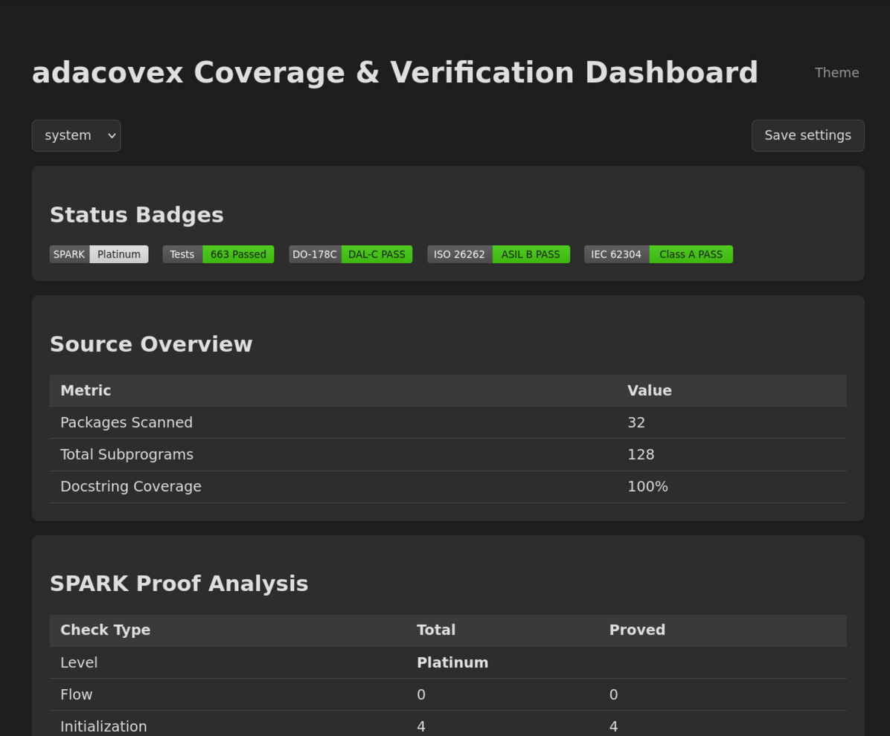

# Web dashboard and JSON API

`adacovex --target=. --serve --port=8080` runs the full assessment and then
starts a built-in HTTP/1.1 server (no external web stack) that serves a
**viewable HTML dashboard** plus a machine-readable JSON API and the SVG
badges. The server blocks until interrupted -- run it in its own terminal, or
as a background process when scripting.

```bash
adacovex --target=. --serve --port=8080
# in another terminal:
curl http://localhost:8080/api/metrics
```

## Endpoints

| Path | Content |
|------|---------|
| `GET /` | HTML dashboard (coverage, proof, test, and compliance cards) |
| `GET /api/metrics` | JSON object with the key assessment metrics |
| `GET /badge/spark.svg` | SPARK assurance level badge |
| `GET /badge/tests.svg` | Test pass/fail badge |
| `GET /badge/do178c.svg` | DO-178C compliance badge (Achieved / Unmet) |
| `GET /badge/iso26262.svg` | ISO 26262 compliance badge |
| `GET /badge/iec62304.svg` | IEC 62304 compliance badge |
| anything else | `404 Not Found` |

The server runs a small HTTP/1.1 implementation with a 4-worker task pool and
serves requests until the process is interrupted (Ctrl-C).

## The HTML dashboard



The page is a single self-contained document (CSS and the theme script are
inlined; no external assets), rendered from the bundled
`resources/dashboard.html` template. It contains one card per area:

- **Status Badges** -- the live badge images, so the dashboard doubles as a
  badge preview.
- **Source Overview** -- packages scanned, total subprograms, and docstring
  coverage %.
- **SPARK Proof Analysis** -- the assessed level (Stone..Platinum) and, per
  check category (flow, initialization, runtime, assertions, functional),
  the total and proved counts, plus total VCs / proved VCs.
- **Test Results** -- every test category with its count and Pass/Fail
  status, plus the total (Passed / Failed).
- **Compliance** -- target integrity level and overall `Achieved` / `Unmet`
  status, HLRs traced, orphan-tag state, whether tests pass, and each unmet
  criterion when the assessment failed.
- **HLR Traceability** -- every package that carries HLR tags, with its tags.

### Standard-awareness

Like the `sbom` subcommand, the dashboard **defaults to all standards** when
no `--standard` / `--asil` / `--class` flag is given: the status badges and
the compliance card list every standard's label at the shared tier (DAL-C,
ASIL B, Class A). An explicit standard flag narrows the dashboard to that
single standard (e.g. `--asil=B` shows only ISO 26262 at ASIL B). See
[Standards](standards.md) for the cross-standard tier mapping.

## The JSON API

`/api/metrics` is a plain HTTP GET, so scripts and CI can consume the
assessment without parsing HTML:

```json
{"spark_level":"Platinum","total_vcs":408,"proved_vcs":408,
 "tests_passed":666,"tests_failed":0,"doc_coverage":100,
 "standard":"all","level":"DAL-C","dal_status":"Achieved",
 "standards":{"DO-178C":{"level":"DAL-C","status":"Achieved"},
               "ISO 26262":{"level":"ASIL B","status":"Achieved"},
               "IEC 62304":{"level":"Class A","status":"Achieved"}}}
```

| Field | Meaning |
|-------|---------|
| `spark_level` | Assessed SPARK level (`Stone`..`Platinum`) |
| `total_vcs` / `proved_vcs` | GNATprove verification-condition counts |
| `tests_passed` / `tests_failed` | Test-result counts |
| `doc_coverage` | Docstring coverage, 0-100 |
| `standard` | `do178c` \| `iso26262` \| `iec62304` \| `all` |
| `level` | Level label for the top-level target (`DAL-C`, `ASIL B`, ...) |
| `dal_status` | `Achieved` or `Unmet` |
| `standards` | Per-standard `level` / `status` object (present when `standard` is `all`) |

## Themes

The dashboard supports **light**, **dark**, and **system** themes. Colors are
driven by CSS custom properties, and a header dropdown switches live between
them; **Save settings** persists the current selection in `localStorage`
(no cookies, key `adacovex-theme`).

Theme resolution on page load:

1. a `?theme=light|dark|system` query parameter on the dashboard URL --
   always wins (this is the supported way to pin the theme when embedding
   the dashboard in an iframe);
2. otherwise the explicit CLI theme (`--theme=light` / `--theme=dark`);
3. otherwise the saved `localStorage` choice, if one was saved;
4. otherwise the system theme (`prefers-color-scheme`).

`--theme` only sets the *initial* selection; the dropdown and Save settings
still override it afterwards in the browser.

## Related CLI flags

| Flag | Default | Description |
|------|---------|-------------|
| `--serve` | off | Start the HTTP dashboard server after the assessment |
| `--port=N` | `8080` | Server port (a valid `Positive` integer) |
| `--theme=NAME` | `system` | Initial dashboard theme: `light` \| `dark` \| `system` (case-insensitive) |
