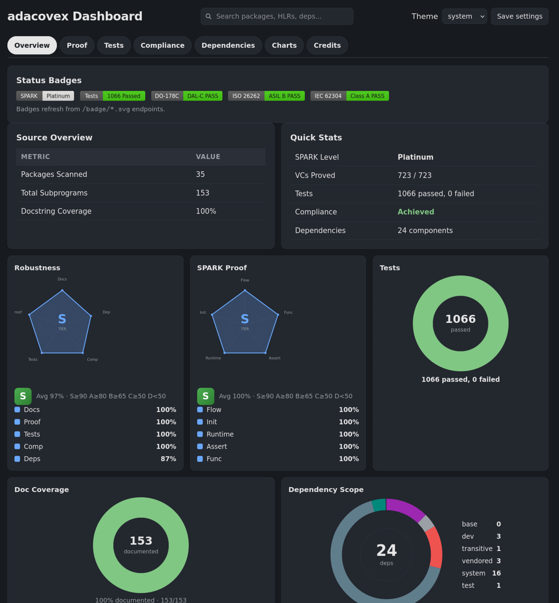
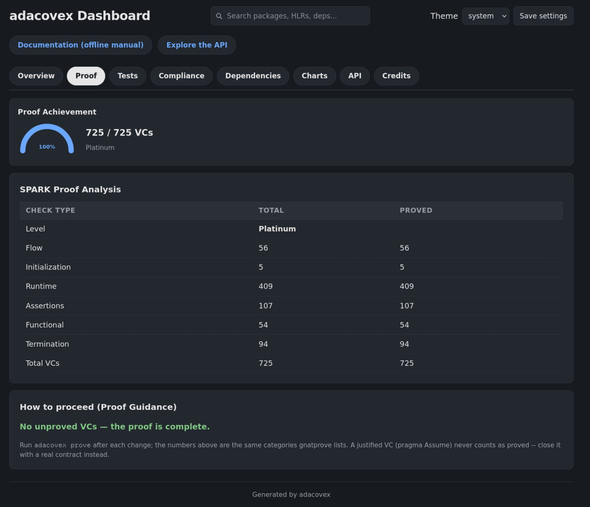
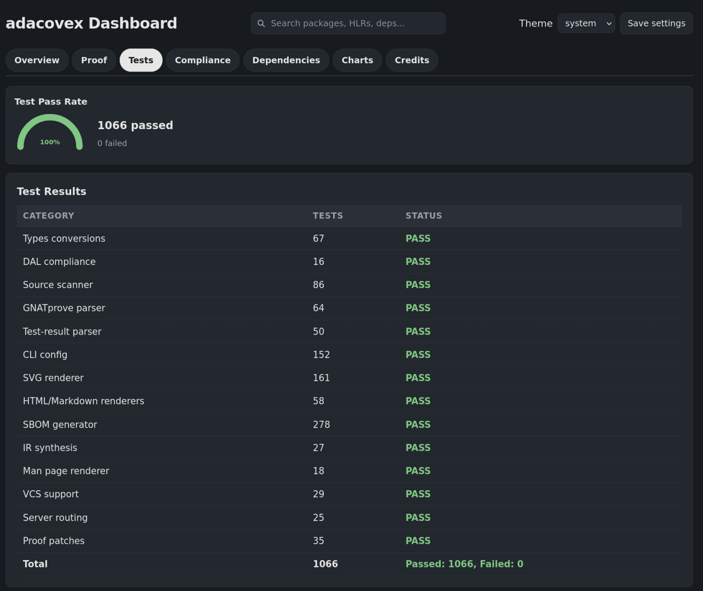
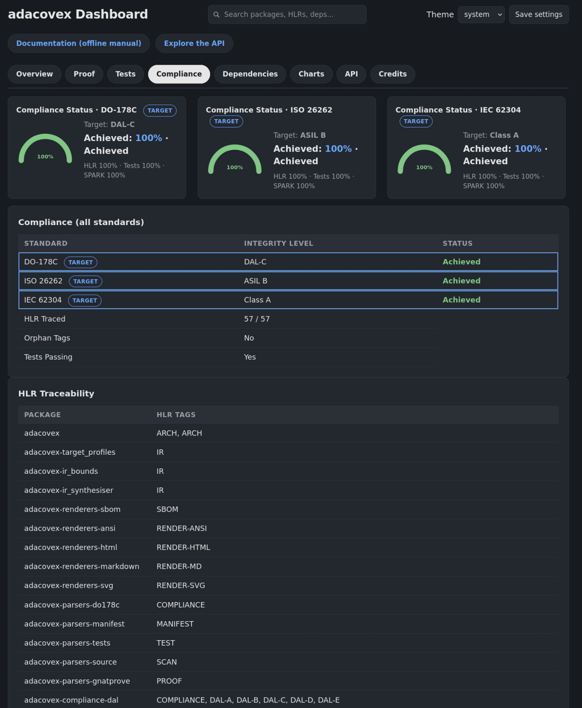
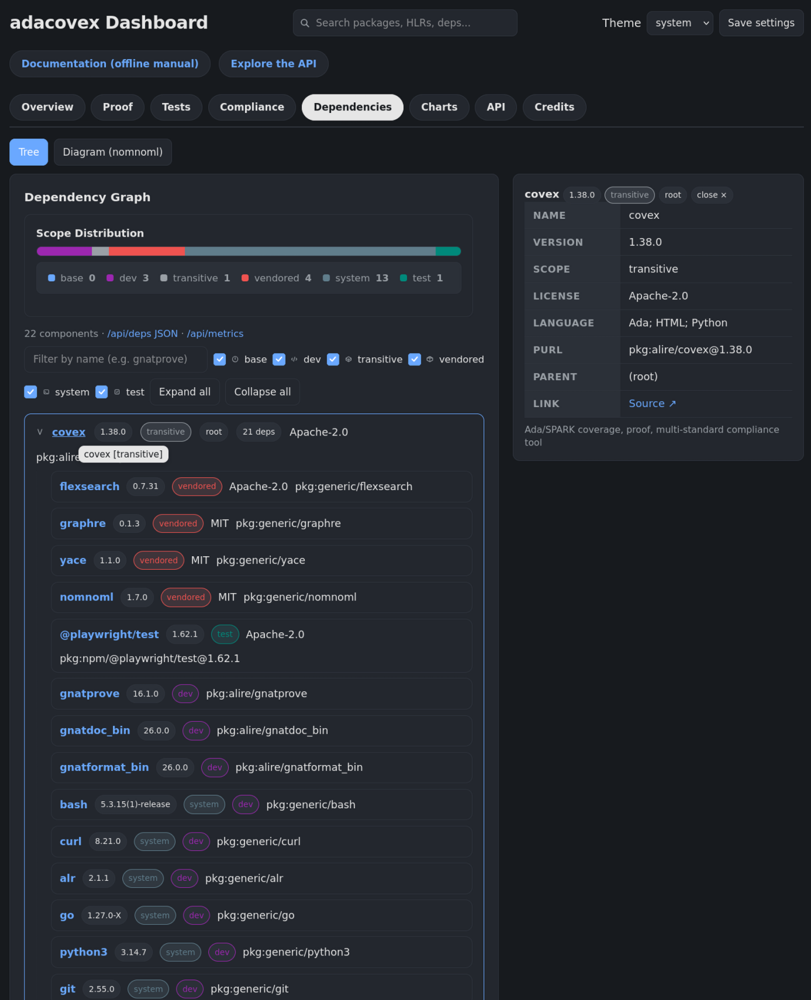
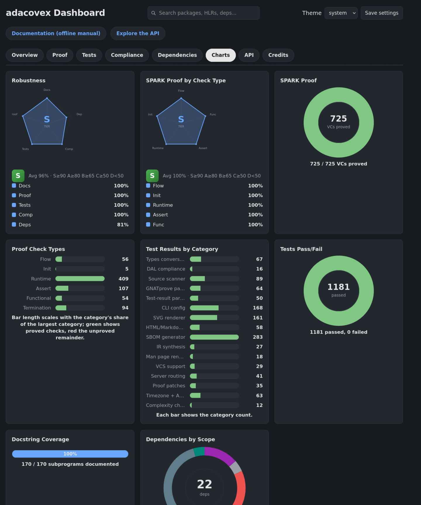
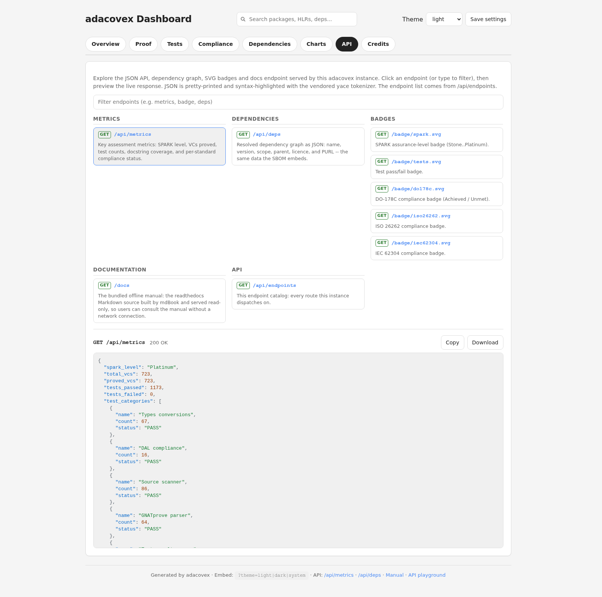

# Web dashboard and JSON API

`adacovex --target=. --serve --port=8080` runs the full assessment and then
starts a built-in HTTP/1.1 server (no external web stack) that serves a
**viewable HTML dashboard** plus a machine-readable JSON API and the SVG
badges. The server blocks until interrupted -- run it in its own terminal, or
as a background process when scripting.

```bash
adacovex --target=. --serve --port=8080
# in another terminal:
curl http://localhost:8080/api/metrics
```

The dashboard guide is split across three pages. This page covers using
the served dashboard and reading its charts (the Overview/Proof/Tests/
Compliance/Charts/API tabs, the metrics charts, and the robustness tier).
The dashboard document itself -- the tab structure, the dependencies tab
and its alternative diagram, the split-view detail panel, global search,
and the tree filter -- is on
[The dashboard document and its dependency views](dashboard-html.md).
The JSON API, the API playground, and the themes are on
[The dashboard JSON API, playground, and themes](dashboard-api.md).

## How to use the dashboard

Open `http://localhost:8080` in a browser. The page is a single self-contained
document (no external assets) with hash-routed tabs. Use the header dropdown to
switch themes (light / dark / system) and **Save settings** to persist your
choice.

### Overview tab



Start here. The **Robustness tier** (S / A / B / C / D) is a single letter that
summarises five quality axes: Docs, Proof, Tests, Compliance, and Deps. An **S**
means the project is healthy across the board. A **D** means one or more axes
are below 50%. Below that:

- **SPARK radar** -- proved verification conditions per check category (flow,
  initialization, runtime, assertions, functional). A balanced polygon means
  every category has strong coverage. A spike in one corner and a flat line in
  another means the proof effort is uneven.
- **Tests donut** -- passed vs failed tests. A full green arc means 100%
  passing. Any red slice means the test suite has failures that must be fixed
  before the project can be assessed as `Achieved`.
- **Doc coverage donut** -- documented subprograms as a percentage of
  total. Strict mode requires 100%. A shortfall here shows exactly how many
  subprograms are missing `--` docstrings.
- **Dependency scope ring** -- the resolved graph broken down by scope
  (base / dev / transitive / vendored / system / test).  It sits in the
  same row as the doc-coverage donut so the Overview uses its width well.
  Each coloured segment is hoverable: hovering shows the scope name and
  its component count (for example `test: 3`).

Proof check bars scale with the category's magnitude, the same way as the
test-category bars: a 407-VC category reads as a longer bar than a 56-VC
one, so relative proof effort is visible at a glance.

### Proof tab



Shows the SPARK level (Stone .. Platinum) and per-category VC counts. The mini **VCs proved / total** at the top is the headline number. Click into a category to see the breakdown.

If a category is low, that is where the proof effort must focus.

### Tests tab



Every test category with its count and Pass / Fail. A single failing category
is enough to fail the compliance gate (`Tests passing` must be `Yes` for every
tier except QM / DAL-E).

### Compliance tab



Shows the target integrity level, overall `Achieved` / `Unmet`, HLRs traced,
orphan-tag state, and every unmet criterion. Use this to verify that every HLR
is tagged in source and that no tags are orphaned (tagged but not defined in
`compliance/HLR.md`).

### Dependencies tab



An interactive dependency tree (or diagram) of every component in the graph. Use the filter input and scope checkboxes to focus on base, dev, transitive, vendored, or system dependencies. Click a node to see its licence, PURL, parent, and a registry link. Use this tab to audit your supply chain: confirm every vendored licence is compatible, see which system tools the build needs (the `system` scope), and trace each component back to its source.

The diagram view (toggle **Tree / Diagram**) renders the same graph as a directed diagram.

### Charts tab



Eight CSS-only cards show the same data as the Overview tab in a different
format: the two shared radars (Robustness and SPARK Proof by Check Type),
proof and test donuts, proof and test bar charts, the docstring radial
gauge, and the dependency scope polar ring. Use this to compare SPARK
proof, test results, doc coverage, and dependency scope at a glance. See
[Metrics charts](#metrics-charts) for the full card-by-card breakdown.

### API tab



An interactive REST API playground: every endpoint the server dispatches on
as a searchable, clickable button, with a pretty-printed, syntax-highlighted
JSON preview. The first endpoint (`/api/metrics`) runs automatically, so
the tab opens with a live preview. See
[The API playground](dashboard-api.md#api-playground) for the full detail.

## Interpreting the charts

- **Green / full arcs** -- the metric is at 100% or close to it.
- **Red slices or flat corners** -- there is a regression or missing data.
- **Scope rings** -- a large vendored wedge means strict-mode docstrings are
  being suppressed by patches. If you see no wedge, vendored code can be
  uncovered.
- **Tier letter drops** -- a drop from `A` to `C` means the average across all
  five axes fell. Check the axis table to see which one regressed.

The same data is available headlessly at `/api/metrics` and via
`--emit-metrics=PATH` (`{"metrics":..., "dependencies":...}`).

| Path | Content |
|------|---------|
| `GET /` | HTML dashboard (tabbed) |
| `GET /api/metrics` | JSON object with the key assessment metrics |
| `GET /api/deps` | JSON dependency graph (same data as the Dependencies tab) |
| `GET /api/endpoints` | JSON endpoint catalog (the list the API playground builds its UI from) |
| `GET /docs` | The bundled offline manual: the Sphinx manual built into the binary (HTML, no external assets) |
| `GET /badge/spark.svg` | SPARK assurance level badge |
| `GET /badge/tests.svg` | Test pass/fail badge |
| `GET /badge/do178c.svg` | DO-178C compliance badge (Achieved / Unmet) |
| `GET /badge/iso26262.svg` | ISO 26262 compliance badge |
| `GET /badge/iec62304.svg` | IEC 62304 compliance badge |
| anything else | `404 Not Found` |

The server runs a small HTTP/1.1 implementation with a 4-worker task pool
(configurable with `--serve-workers=N`, which is a related flag of
`--serve`) and serves requests until the process is interrupted (Ctrl-C).
Query strings and URL fragments are stripped before routing, so
`/?theme=light`, `/api/metrics?x=1` and `/api/deps#top` reach the same
handlers as `/`, `/api/metrics` and `/api/deps` instead of 404ing.

## Bundled offline manual

The `--serve` server also serves the **bundled offline manual** at `/docs`
(both spellings, with and without the trailing slash, reach the same page).
The manual is the same Markdown source that powers the Read the Docs site
(`docs/`, a Sphinx project with `docs/conf.py` + MyST); at build
time `tools/gen-docs.py` runs `sphinx-build` and bundles the resulting site
into the binary (`src/adacovex-docs_template.ads`) as a lookup table plus
static string constants: every page, stylesheet, script, and badge, keyed
by site-relative path, so the manual is fully self-contained and
navigable offline (each constant stays small -- a single multi-megabyte
blob would overflow the gnatprove frontend stack, so the search index is
split into chunks and the server streams them).

Sphinx's own search machinery (searchindex.js, searchtools.js, the
stemmers) is bundled and the search box works exactly as on the online
site. The PNG screenshots are dropped (they show as notes), the
`_sources/` page-source links are stripped, and the bundled HTML stays pure
ASCII (non-ASCII glyphs are encoded as UTF-8 byte values in the Ada
source). Users on a machine without a network connection can still open the
manual from the dashboard -- the header **Documentation (offline manual)**
link and the API playground's `/docs` endpoint both point at it.

## Metrics charts

The **Charts** tab renders eight cards and is a **strict superset** of the
Overview charts: every chart that appears on the Overview also appears
here. The charts are hand-rolled (no vendored chart library): donut rings
are a conic gradient with a CSS hole (the same pattern as the polar ring)
and bars are flex rows with a fixed label column, so labels never rotate
or overflow and the ring colour reflects the covered share (fully green at
100%):

- **Robustness** -- the five-axis health radar (Docs, Proof, Tests, Comp,
  Deps) with the S/A/B/C/D tier rating, the same headline visual as the
  Overview tab. It is shared with the Overview (one source of truth), so
  the Charts tab is a superset and the two tabs cannot drift apart.
- **SPARK Proof by Check Type** -- the per-category proof radar (Flow,
  Init, Runtime, Assert, Func) shown on the Overview, also shared.
- **SPARK Proof** -- *donut* of proved vs unproved VCs (`720/720` shows a
  full green ring. `680/720` shows `94%` green + `6%` red unproved).
- **Proof Check Types** -- *bars* of proved checks per category (flow,
  init, runtime, assertions, functional, termination).  The green proved
  fill and red unproved remainder are sized against the largest category
  (green + red = the category's share of the biggest), with the grey track
  showing the scale remainder -- so bars scale with magnitude exactly like
  the test chart.  The numbers mirror gnatprove's own summary table: on
  gnatprove 16 the
  Flow category sums the "Data Dependencies" and "Flow Dependencies" rows,
  and every category's proved count is Total - Justified - Unproved, so the
  rows sum exactly to the Total.
- **Test Results by Category** -- *bars* of per-category test counts
  (normalised to the largest category; long category names ellipsise in
  the fixed label column instead of overflowing).
- **Docstring Coverage** -- *radial gauge* (half-circle SVG arc) of
  documented vs total subprograms.
- **Tests Pass/Fail** -- *donut* of passed vs failed tests (fully green
  when every test passes).
- **Dependencies by Scope** -- *polar ring* of base / dev / transitive /
  vendored / system / test components (conic-gradient + CSS hole,
  `--scope-*` theme variables) with a legend. Skipped when the graph is
  empty.

Each card is a different type (radar / radar / donut / bars / bars / radial / donut / polar) so the tab reads at a glance without duplicating a data story. The two radars are shared with the Overview, so the Charts tab contains every Overview chart. No JavaScript is required for the charts (pure CSS/SVG). The radial gauge, the scope ring, and the radars follow the light/dark theme automatically via CSS variables.

The surrounding grid (`chart-grid`) is responsive and the page container is `max-width:1180px` so large monitors do not stretch cards. Rings are used where a part-to-whole distribution is the point. Bars are used where a max-normalised comparison across categories is the point.

## Robustness tier

The Overview tab leads with a **Robustness** radar spider and a tier rating
(S / A / B / C / D) so the health of the whole project can be read at a
glance.  Five quality axes, each a `0..100` percentage:

| Axis | Meaning |
|------|---------|
| **Docs**   | Docstring coverage: documented subprograms / total |
| **Proof**  | SPARK VCs proved / total |
| **Tests**  | Test pass rate: passed / (passed + failed) |
| **Comp**   | Compliance gate: `100` when the target standard is Achieved, `0` when Unmet |
| **Deps**   | Dependency hygiene: (graph components - vendored) / total |

The average of the five axes maps to the tier letter:

| Tier | Average | Colour |
|------|---------|--------|
| S | >= 90 | green |
| A | >= 80 | blue |
| B | >= 65 | purple |
| C | >= 50 | orange |
| D | < 50  | red |

The radar polygon, the per-axis legend with percentages, and the tier chip
are rendered as inline SVG/CSS with integer math (no floating point in the
renderer) and use `var(--accent)` plus per-tier CSS variables, so they follow
the light/dark theme.  Next to it, a small **SPARK radar** shows the proved
count per check type, also as an inline-SVG spider, and the **Tests** donut
and **Doc Coverage** radial gauge give the same pass/fail and coverage
numbers as the full-size charts.
